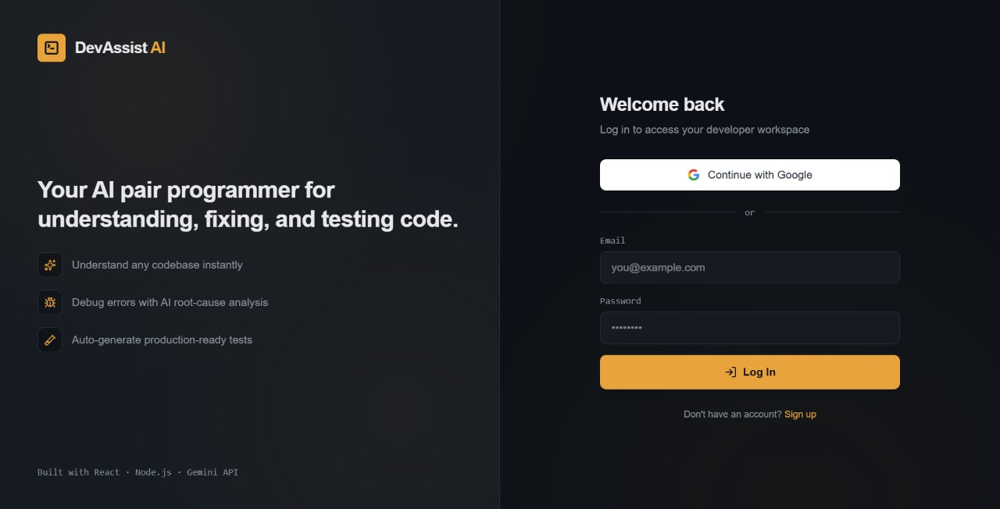
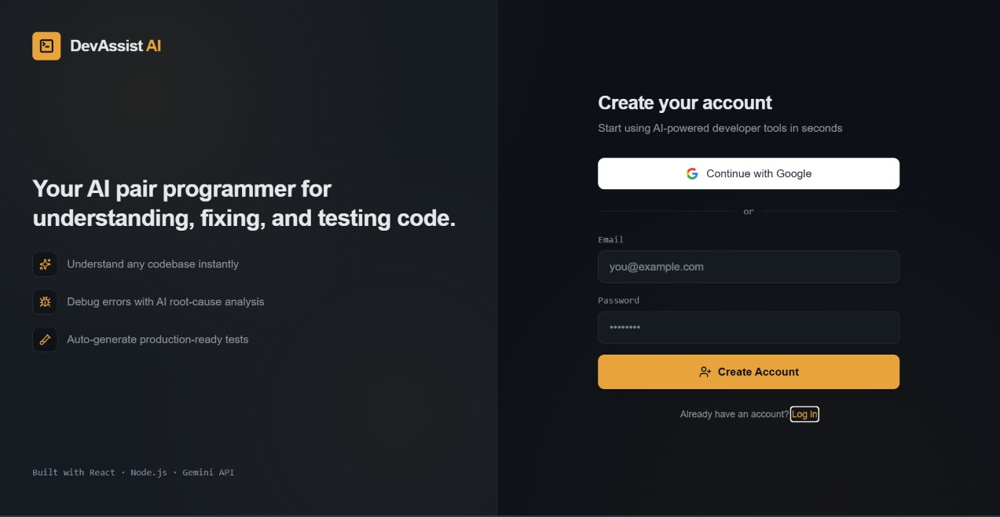
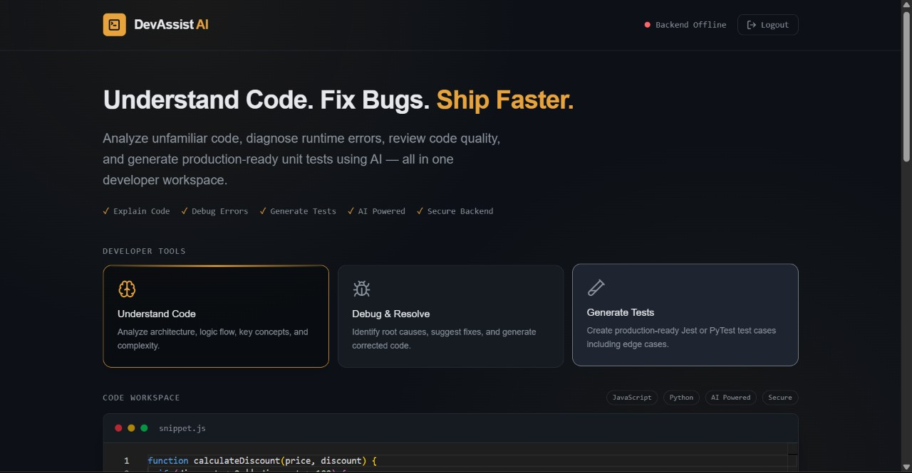
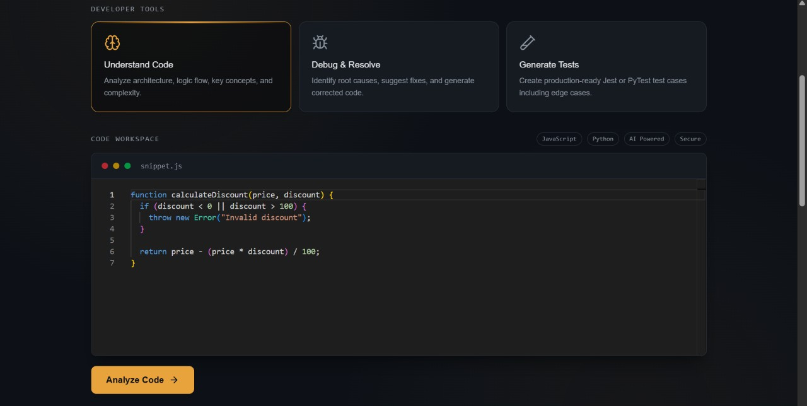
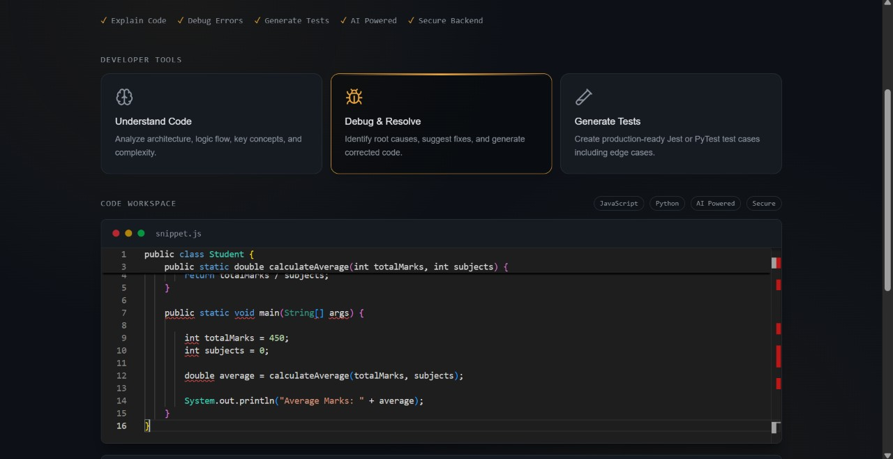
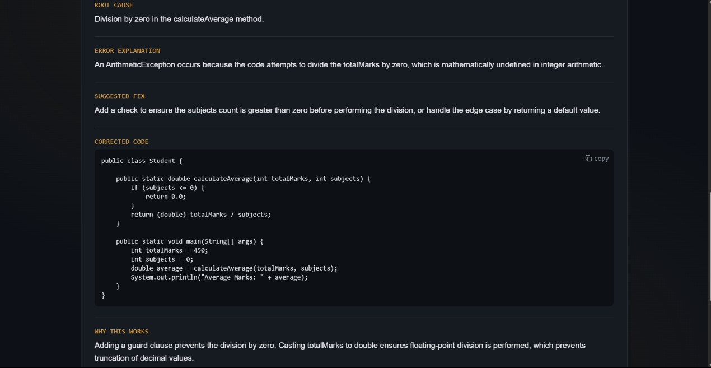
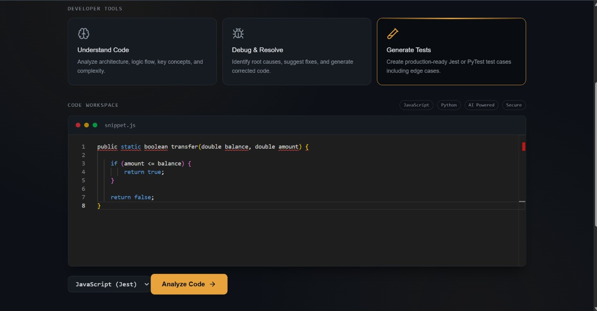
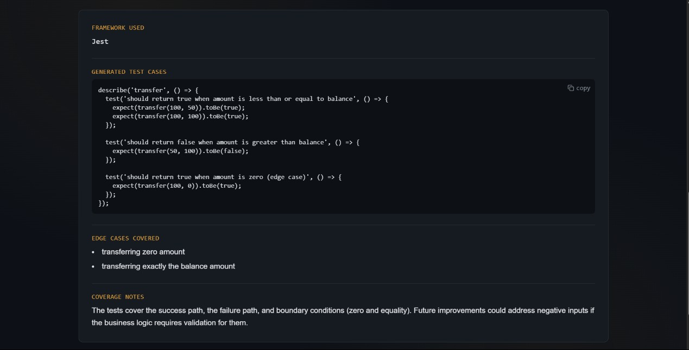

# DevAssist AI

**Understand Code. Fix Bugs. Ship Faster.**

DevAssist AI is an AI-powered developer productivity platform that helps developers understand unfamiliar codebases, debug runtime errors with root-cause analysis, and auto-generate production-ready unit tests — all in one workspace.

🔗 **Live App:** [devassist-ai-three.vercel.app](https://devassist-ai-three.vercel.app)

---
## Screenshots

### Authentication

### Dashboard

### AI Tools in Action

---
## Features

- 🧠 **Understand Code** — Analyzes architecture, logic flow, key concepts, and complexity of any pasted code snippet.
- 🐛 **Debug & Resolve** — Identifies root causes of runtime/logic errors, suggests fixes, and generates corrected code.
- ✅ **Generate Tests** — Creates production-ready Jest / PyTest unit tests, including edge cases.
- 🔐 **Secure Authentication** — Email/password auth with email confirmation, plus Google Sign-In (OAuth), powered by Supabase Auth.
- ⚡ **AI Engine** — Built on Google's Gemini API for fast, structured code analysis.

---

## Tech Stack

**Frontend**
- React + Vite
- Tailwind CSS
- Deployed on Vercel

**Backend**
- Node.js + Express
- Google Gemini API for AI analysis
- Deployed on Render

**Auth & Database**
- Supabase (Auth + email confirmation + Google OAuth)

---

## How It Works

1. User signs up / logs in (email or Google).
2. User pastes a code snippet into the workspace editor.
3. User selects a tool — Explain, Debug, or Generate Tests.
4. The request is sent to the Express backend, which builds a structured prompt and calls the Gemini API.
5. Gemini returns a structured JSON response (root cause, explanation, fix, corrected code, best practices, or generated test cases).
6. The frontend renders the AI's response in a clean, readable format.

---

## Author

Built by **Harshini Jetti** — Computer Science Engineering student.